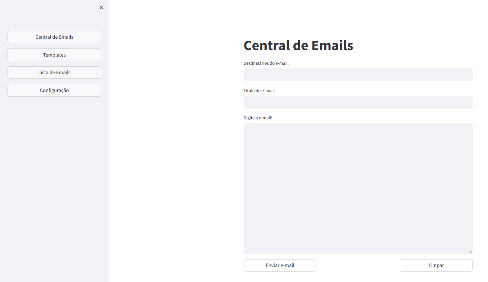

<h1 align="center"> Central de Envio de E-mails </h1>

Aplicativo Web para gerenciar listas e templates de email e realizar o envio pelo Gmail. 

  <a href="#-tecnologias">Tecnologias</a>&nbsp;&nbsp;&nbsp;|&nbsp;&nbsp;&nbsp;
  <a href="#-projeto">Projeto</a>&nbsp;&nbsp;&nbsp;|&nbsp;&nbsp;&nbsp;
  <a href="#memo-licença">Licença</a>

  

 

  

## 🚀 Tecnologias

Esse projeto foi desenvolvido com as seguintes tecnologias:

- Python
- Streamlit
- Gmail

Obs: Para criar a senha app do Gmail, para enviar os emails, acesse a documentação: [LINK](https://support.google.com/mail/answer/185833?hl=pt-BR#:~:text=Criar%20e%20usar%20senhas%20de%20app%201%20Acesse,as%20instru%C3%A7%C3%B5es%20na%20tela.%20...%208%20Selecione%20Conclu%C3%ADdo.)

## 💻 Projeto

A Central de envio de e-mails é um WebApp para gerenciar templates e listas de e-mails para envio de e-mails utilizando o Gmail.

## :memo: Licença

Esse projeto está sob a licença MIT.

---

Feito com ♥ by Robson :wave: [Contato](https://www.linkedin.com/in/robsonlopesjr/)